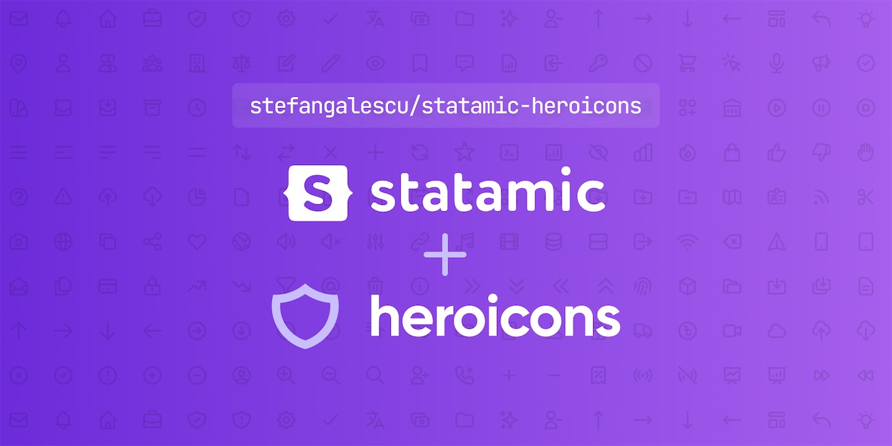

<!-- statamic:hide -->



# Statamic Heroicons

<!-- /statamic:hide -->

A package to easily make use of Heroicons in your Statamic sites. This package is a wrapper over [`blade-ui-kit/blade-heroicons`](https://github.com/blade-ui-kit/blade-heroicons).

For a full list of available icons see [the SVG directory](https://github.com/blade-ui-kit/blade-heroicons/tree/main/resources/svg) from the [`blade-ui-kit/blade-heroicons`](https://github.com/blade-ui-kit/blade-heroicons) repository or preview them at [heroicons.com](https://heroicons.com/). Heroicons are originally developed by [Steve Schoger](https://twitter.com/steveschoger) and [Adam Wathan](https://twitter.com/adamwathan).

If you're looking to use Heroicons v1, please use the v1 version of the package.

## Requirements

- PHP 8.1 or higher
- Laravel 9.0 or higher
- Statamic 3.3 or higher

Apart from the requirements above, it is required that you use Statamic's new Runtime Antlers engine. Read more about it and how to enable it in [Statamic's official documentation](https://statamic.dev/new-antlers-parser#about).

## Documentation

### Installation

First, require `statamic-heroicons` as a Composer dependency:

```shell
composer require stefangalescu/statamic-heroicons
```

If you need additional options, you can publish the [`blade-ui-kit/blade-heroicons`](https://github.com/blade-ui-kit/blade-heroicons) config. Make sure to also look into the [icon caching](https://github.com/blade-ui-kit/blade-icons#caching) feature provided by [`blade-ui-kit/blade-heroicons`](https://github.com/blade-ui-kit/blade-heroicons).

### Usage

```antlers
{{ heroicon:mini:bars-3 }}

{{ heroicon:solid:bars-3 }}

{{ heroicon:outline:bars-3 }}

{{ heroicon:outline:bars-3 class="text-gray-500" }}

{{ heroicon :variant="variant" :icon="icon" }}
```

Apart from a couple of reserved prop names (`as`, `scope`, `variant`, `icon`), any prop you pass (e.g. `class`, `style`, `aria-hidden` etc.) to the tag will be added to the root SVG element.

The `{{ heroicon }}` tag also allows you to pass dynamically binded attributes like you would use in a JavaScript framework like Alpine.js. The only gotcha is that you cannot use the shorthand syntax `:class="condition ? 'text-red-500' : 'text-green-500'"`. You must use the full binding (e.g. `x-bind:class`, `v-bind:class`). Example:

```antlers
{{ heroicon:solid:bars-3 class="w-5 h-5" title="Main menu" }}

{{ heroicon:solid:bars-3 class="w-5 h-5" x-bind:class="condition ? 'text-red-500' : 'text-green-500'" }}
```

### Testing

```bash
composer test
```

## Security

Only the latest version of `statamic-heroicons` will receive security updates if a vulnerability is found.

If you discover a security vulnerability, please report it to Stefan Galescu straight away, [via email](mailto:stefan.galescu@gmail.com). Please don't report security issues through GitHub Issues.

## Sponsor Stefan

This addon is open-source, meaning anyone can use this addon in their sites for **free**!

However, maintaining and developing new features for open-source projects can take quite a bit of time. If you're using `statamic-heroicons` in your production environment, please [consider sponsoring me](https://github.com/sponsors/stefangalescu) for however you consider to be a fair amount.
